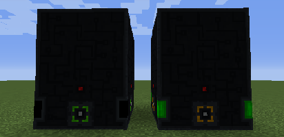

---
navigation:
  title: Reator
  parent: generators/index.md
  icon: powah:reactor_starter
  position: 4
item_ids:
  - powah:reactor_basic
  - powah:reactor_blazing
  - powah:reactor_hardened
  - powah:reactor_niotic
  - powah:reactor_nitro
  - powah:reactor_spirited
  - powah:reactor_starter
---

# Reator

O Reator é um gerador multibloco (FE) que usa uraninita como combustível principal. 

Para construí-lo, você precisará de 36 blocos de reator em sua mão e colocá-los em uma área substituível de 3X4, então o Reator completará a construção automaticamente. 

|                                          | Capacidade                                           | Fator de Geração                                             | Extração Máxima                                   |
| ---------------------------------------- | ---------------------------------------------------- | ------------------------------------------------------------ | ------------------------------------------------- |
| <ItemLink id="powah:reactor_starter" />  | <powah:EnergyCapacity id="powah:reactor_starter" />  | <powah:EnergyGenerationFactor id="powah:reactor_starter" />  | <powah:EnergyMaxIO id="powah:reactor_starter" />  |
| <ItemLink id="powah:reactor_basic" />    | <powah:EnergyCapacity id="powah:reactor_basic" />    | <powah:EnergyGenerationFactor id="powah:reactor_basic" />    | <powah:EnergyMaxIO id="powah:reactor_basic" />    |
| <ItemLink id="powah:reactor_hardened" /> | <powah:EnergyCapacity id="powah:reactor_hardened" /> | <powah:EnergyGenerationFactor id="powah:reactor_hardened" /> | <powah:EnergyMaxIO id="powah:reactor_hardened" /> |
| <ItemLink id="powah:reactor_blazing" />  | <powah:EnergyCapacity id="powah:reactor_blazing" />  | <powah:EnergyGenerationFactor id="powah:reactor_blazing" />  | <powah:EnergyMaxIO id="powah:reactor_blazing" />  |
| <ItemLink id="powah:reactor_niotic" />   | <powah:EnergyCapacity id="powah:reactor_niotic" />   | <powah:EnergyGenerationFactor id="powah:reactor_niotic" />   | <powah:EnergyMaxIO id="powah:reactor_niotic" />   |
| <ItemLink id="powah:reactor_spirited" /> | <powah:EnergyCapacity id="powah:reactor_spirited" /> | <powah:EnergyGenerationFactor id="powah:reactor_spirited" /> | <powah:EnergyMaxIO id="powah:reactor_spirited" /> |
| <ItemLink id="powah:reactor_nitro" />    | <powah:EnergyCapacity id="powah:reactor_nitro" />    | <powah:EnergyGenerationFactor id="powah:reactor_nitro" />    | <powah:EnergyMaxIO id="powah:reactor_nitro" />    |

<Row>
<RecipeFor id="powah:reactor_starter" />
<RecipeFor id="powah:reactor_basic" />
<RecipeFor id="powah:reactor_hardened" />
<RecipeFor id="powah:reactor_blazing" />
<RecipeFor id="powah:reactor_niotic" />
<RecipeFor id="powah:reactor_spirited" />
<RecipeFor id="powah:reactor_nitro" />
</Row>