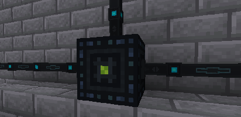

---
navigation:
  title: Células do Ender
  parent: storage_transfer/index.md
  icon: powah:ender_cell_starter
  position: 2
item_ids:
  - powah:ender_cell_basic
  - powah:ender_cell_blazing
  - powah:ender_cell_hardened
  - powah:ender_cell_niotic
  - powah:ender_cell_nitro
  - powah:ender_cell_spirited
  - powah:ender_cell_starter
---

# Células do Ender

A Célula do Ender é um bloco usado para armazenar energia (FE) para um canal específico da rede ender do proprietário. 

Você pode acessar a energia armazenada de um canal selecionado de qualquer lugar do mundo se a Célula do Ender da qual deseja transferir energia tiver um canal ativo com uma capacidade válida. 

|                                             | I/O Máximo                                           |
| ------------------------------------------- | ---------------------------------------------------- |
| <ItemLink id="powah:ender_cell_starter" />  | <powah:EnergyMaxIO id="powah:ender_cell_starter" />  |
| <ItemLink id="powah:ender_cell_basic" />    | <powah:EnergyMaxIO id="powah:ender_cell_basic" />    |
| <ItemLink id="powah:ender_cell_hardened" /> | <powah:EnergyMaxIO id="powah:ender_cell_hardened" /> |
| <ItemLink id="powah:ender_cell_blazing" />  | <powah:EnergyMaxIO id="powah:ender_cell_blazing" />  |
| <ItemLink id="powah:ender_cell_niotic" />   | <powah:EnergyMaxIO id="powah:ender_cell_niotic" />   |
| <ItemLink id="powah:ender_cell_spirited" /> | <powah:EnergyMaxIO id="powah:ender_cell_spirited" /> |
| <ItemLink id="powah:ender_cell_nitro" />    | <powah:EnergyMaxIO id="powah:ender_cell_nitro" />    |

<Row>
<RecipeFor id="powah:ender_cell_starter" />
<RecipeFor id="powah:ender_cell_basic" />
<RecipeFor id="powah:ender_cell_hardened" />
<RecipeFor id="powah:ender_cell_blazing" />
<RecipeFor id="powah:ender_cell_niotic" />
<RecipeFor id="powah:ender_cell_spirited" />
<RecipeFor id="powah:ender_cell_nitro" />
</Row>